# ccxpLite

A lightweight browser extension that enhances usability of the NTHU academic information system ([CCXP](<(https://www.ccxp.nthu.edu.tw/ccxp/INQUIRE/)>)) with a cleaner experience.

## Feature

- Restructured login page prioritizing login usability
- Auto decaptcha for login page (99.95% accuracy) and OAuth page (98.79% accuracy)
- Save favorite functions for quick access
- Categorized full-screen menu for better navigation (optional)
- Saturation and texture suppression for a cleaner look
- Broader English support

## Download & Installation

We provide both [Google Web Store](https://chromewebstore.google.com/detail/glcnfmnbmknbphfgjgbokbbchahmiakk?utm_source=item-share-cb) and [Firebox Add-ons](https://addons.mozilla.org/zh-TW/firefox/addon/ccxplite/) support.

## Demo

| Screen            | Original                                                                                                   | Sidebar Mode                                                                                                  | Menu Mode                                                                                               |
| ----------------- | ---------------------------------------------------------------------------------------------------------- | ------------------------------------------------------------------------------------------------------------- | ------------------------------------------------------------------------------------------------------- |
| Login             | 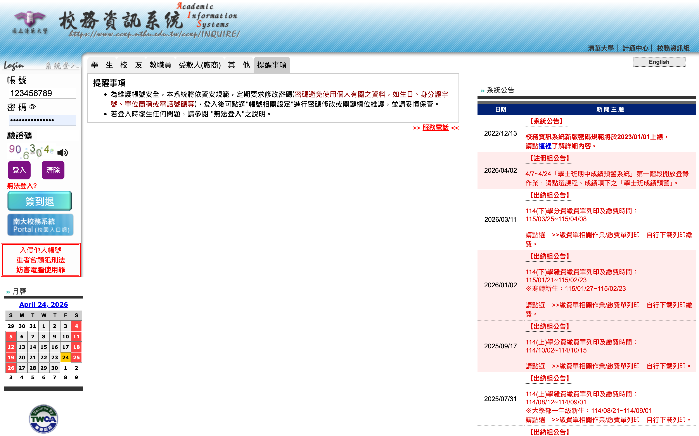                               | 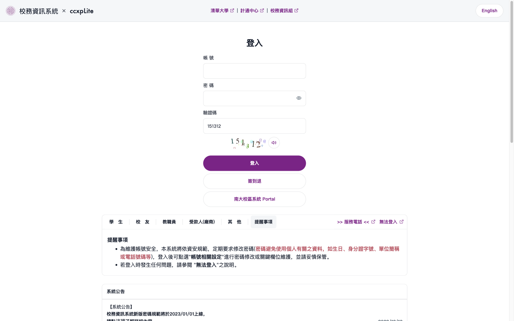                               |                                |
| Main              | 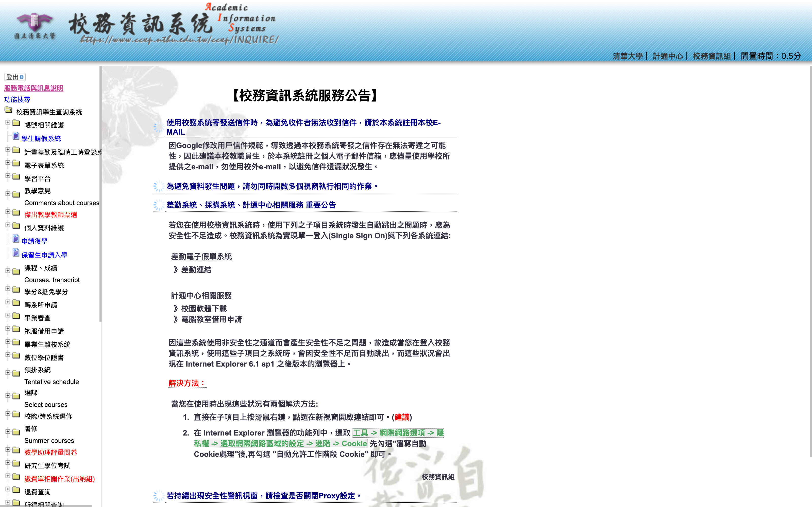                                 | 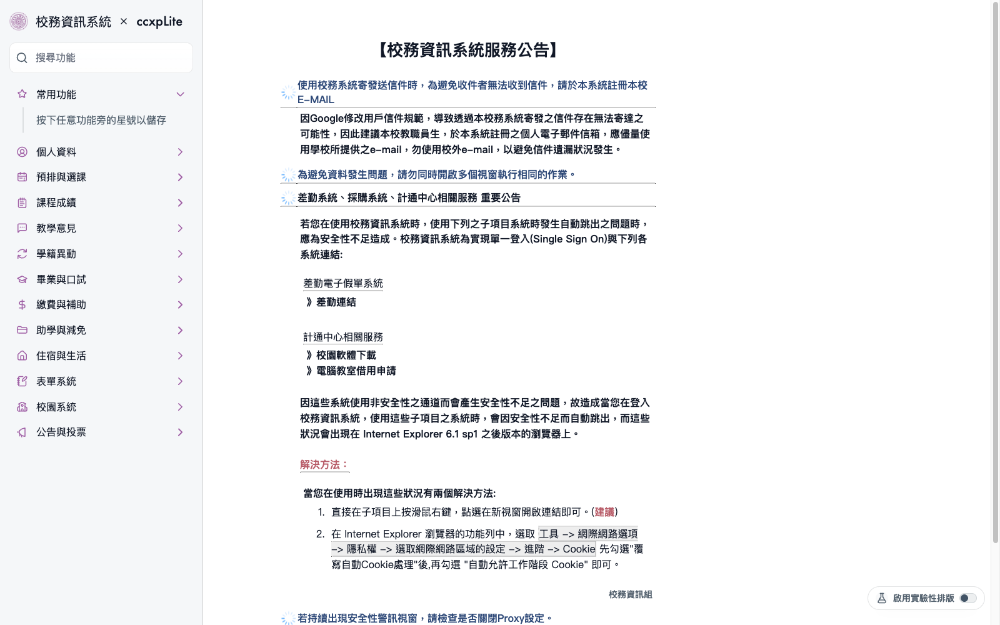                                 | 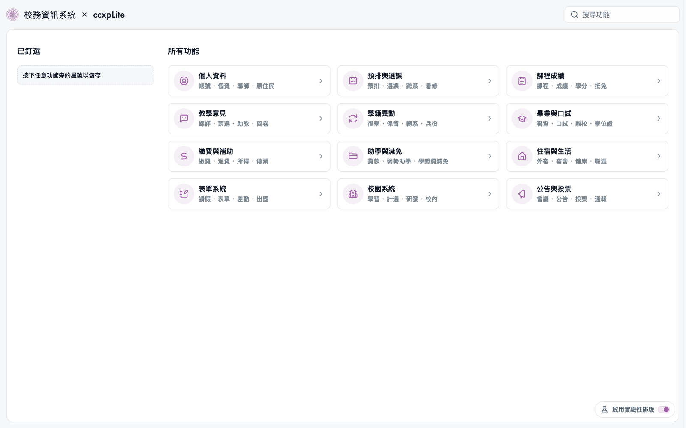                                 |
| Category Expanded | 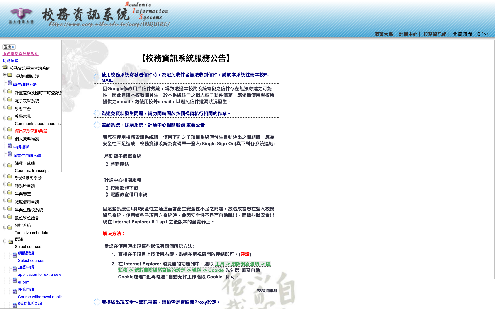               | 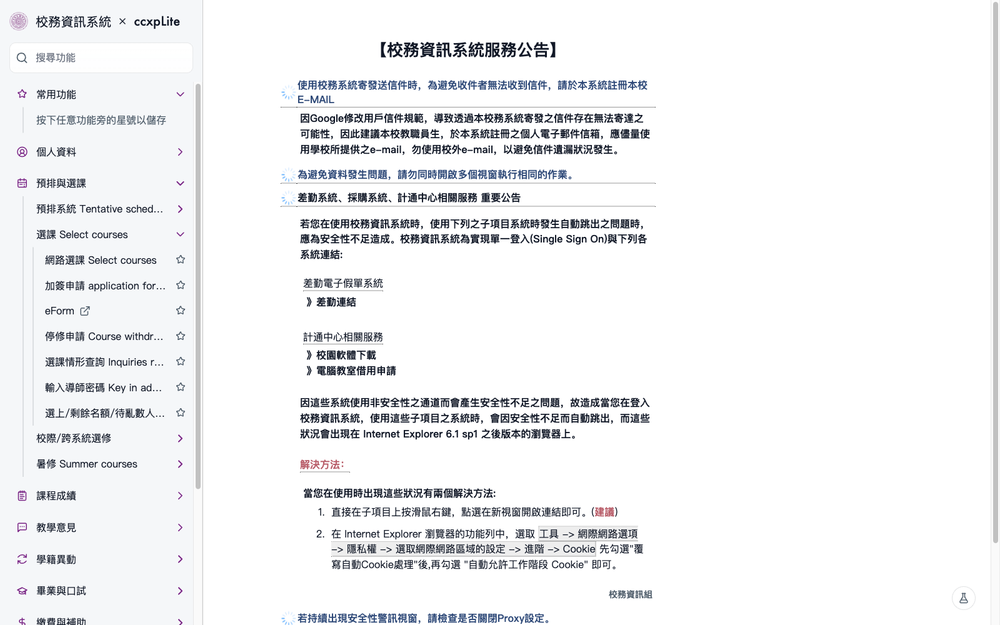               | 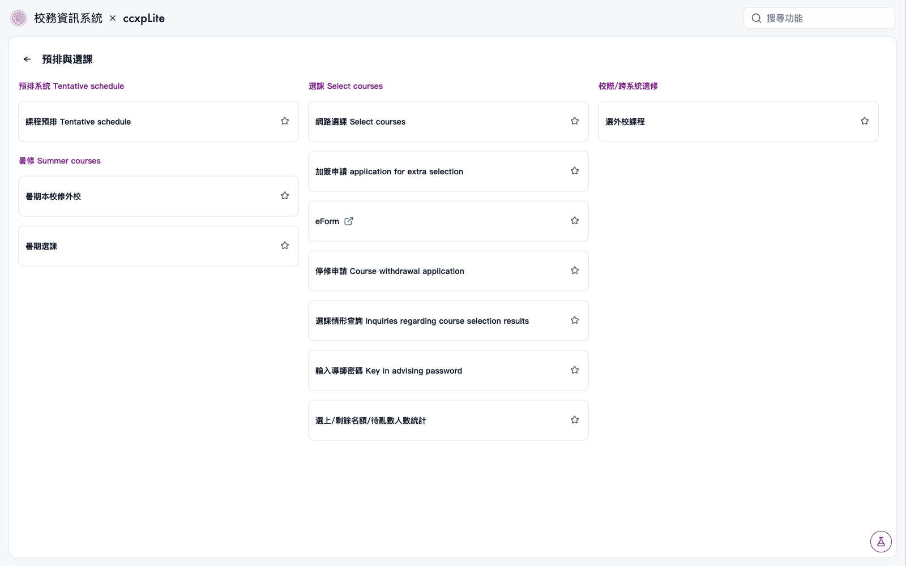               |
| Funtion Selected  | 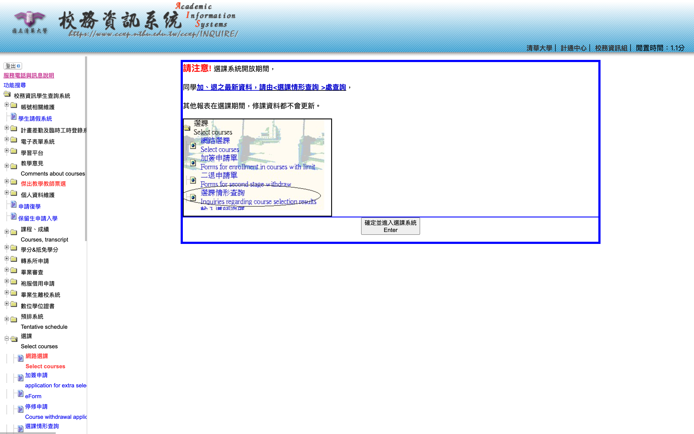 | 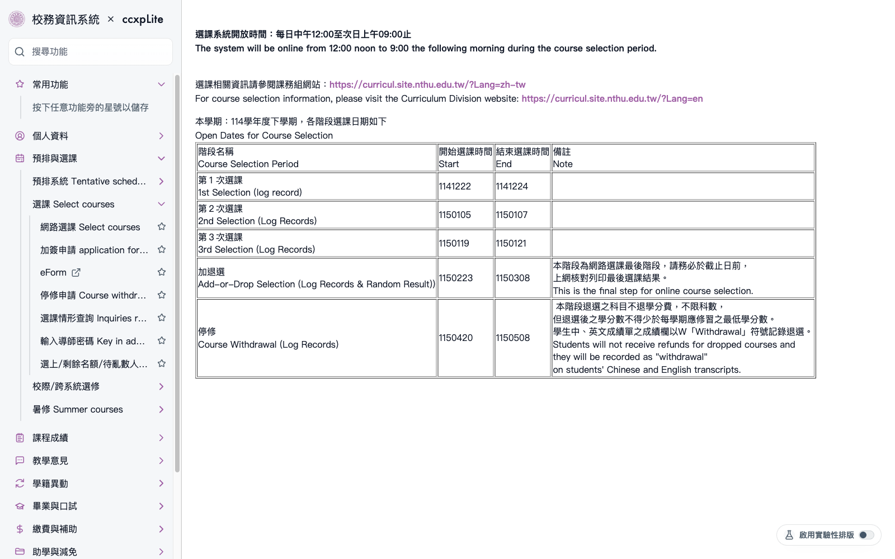 | 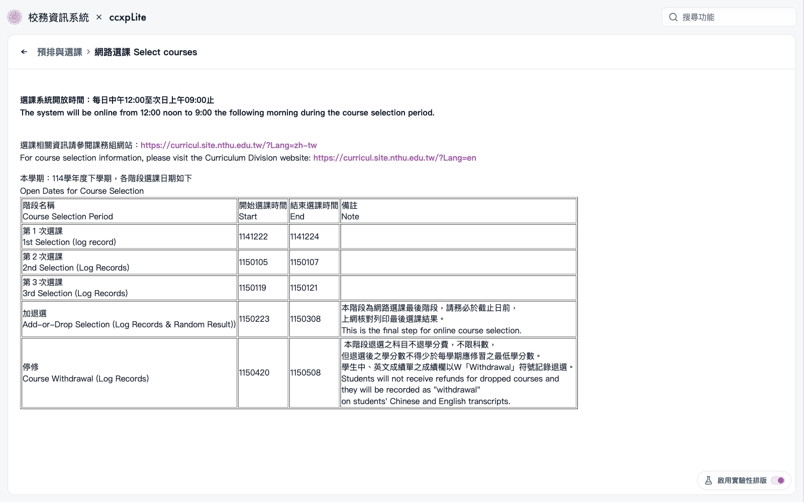 |

## Decaptcha

The extension bundles decaptcha models from [ccxpDecaptcha](https://github.com/Hsiii/ccxpDecaptcha) and runs inference locally in the content script.
